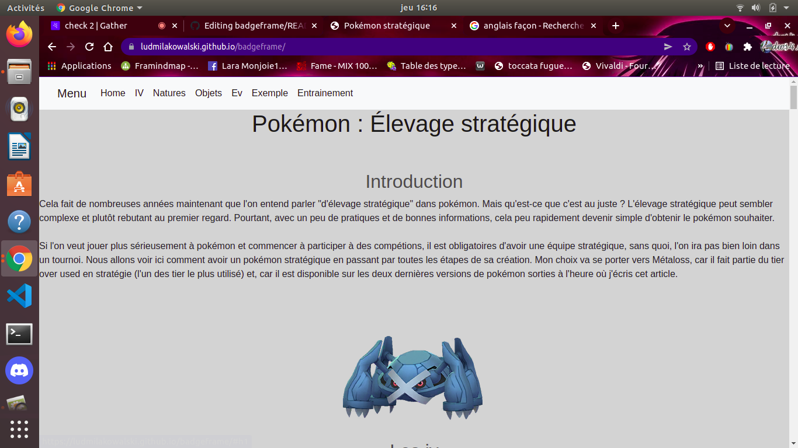
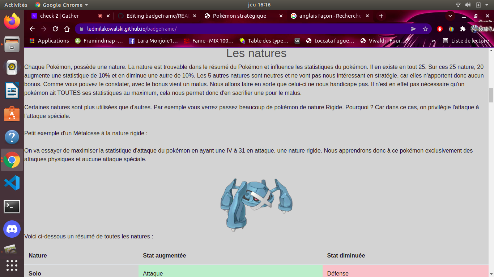

# Badge frame- Additional Exercice

## Instructions

This project use to improve my skills to use a framework, especialy bootstraps. I created a page with some typical stuf proper to bootstraps.

## Techno

I used html and css and the framework bootstrap.

## Result

You can see here some screenshot of the website.

Home :

Nature :

## Link

https://ludmilakowalski.github.io/badgeframe/
